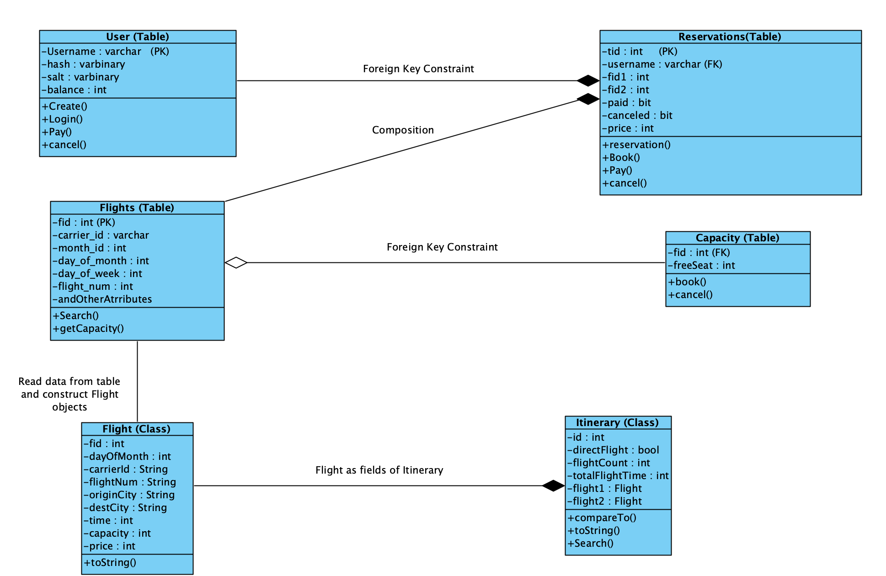

We added three custom tables in our design. They are used to store some long term data utilized by different methods. They play important roles in guaranteeing the ACID properties of our database system. 

Users: We created the Users table to store user information including username, password, and balance. We need to read from the table when performing create(), login(), pay() and update the table if an user is created,  a payment is made, or a paid reservation is canceled. 
username: unique across the system
Hash: generated with password and salt
Salt: used to generate Hash.
Balance: indicating the money left in user’s account

Reservations: We use the table to store all the reservations made by different users. We need to read from it in pay(), reservation(), book(), and cancel. We need to update it after a user pays,  books or cancels a reservation successfully.

Rid: unique reservation id is automatically generated by SQL server. Starting from 1 and increment by 1
Username: references username from users
Fid1: flight id of the first flight
Fid2: flight id of the second flight if exists
Canceled: indicating if the reservation has been canceled
price : total price of the flight(s) in this reservation
We did not set a foreign Key constraint for Fid because many reservations only has 1 flight and Fid2 needs to be null.

Capacity: We use this table to keep track of the remaining capacity of each flight. We need to read from it whenever a user needs to book a flight and update it after booking or canceling successfully. 
Fid: flight id
freeSeat: indicating the amount of seat left in that flight

Itinerary(Class)
We added a custom class Itinerary to facilitate the implementation of search(). It implements the comparable interfaces. This class keeps track of the Itinerary id, if it is a direct-flight, and the flight(s) included in this itinerary. This class is comparable so that the itineraries to output can be sorted accordingly when we output the result. We decided not to put Itinerary in the database since we only need it locally within each terminal and it is not  long-term data.  Itineraries are constructed by reading data from the database and it is more convenient and efficient to store them locally after doing read operations on the database. We also implemented the to String() method to output the result in the required format. 

Deadlock handling: 
We handled the deadlock by implementing a retry mechanism with a while loop for each transaction. We capped the maximum retry times to be 10. 
